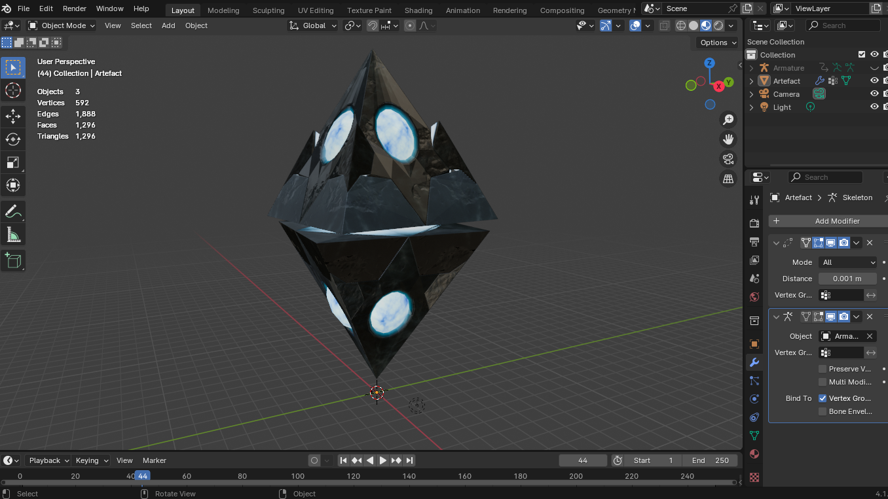

# Blender Gladius Addon
Blender addon for importing models from the game  Warhammer 40,000: Gladius - Relics of War

## Features
Simply select a unit `.xml` file and the addon will automatically load all its data, including:
- **Meshes**: Imports mesh data from `.msh` files.
- **Animations**: Loads animations from `.anm` files.
- **Textures**: Creates Blender materials using multiple `.dds` textures declared in `.xml` files.

## Installation
## Installation
1. Make sure your Blender version is 4.4 or newer.
2. Download the latest release from the [Releases page](https://github.com/amorgun/blender_gladius/releases/).
3. Drag and drop the archive into Blender and click `OK`
4. Restart Blender
5. Go to `Edit -> Preferences -> Add-ons`, find `Gladius - Relics of War .MSH meshes and .XML unit files` there
6. Set up the `Data folder` option to the path to your `Data` folder.

## Import
In Blender go to `File -> Import -> Gladius Unit (.xml)` and select your file.

## Export
To export models back to the game you can use the official Blender addon (located inside the `/Resources/Blender` folder of your Gladius installation).

## Disclaimer
Not affiliated with Proxy Studios.
